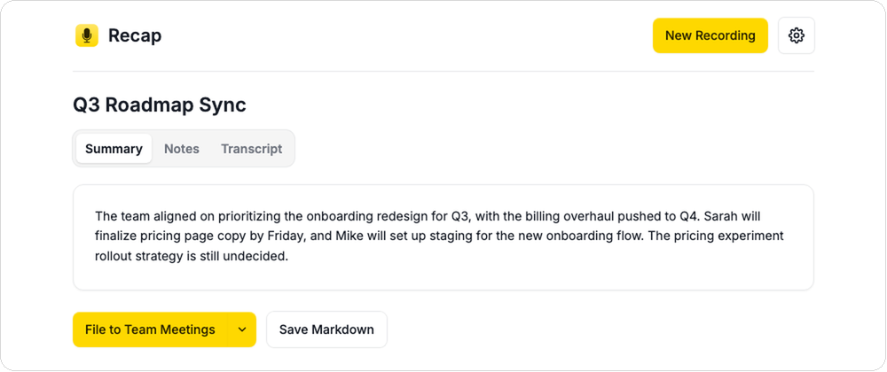
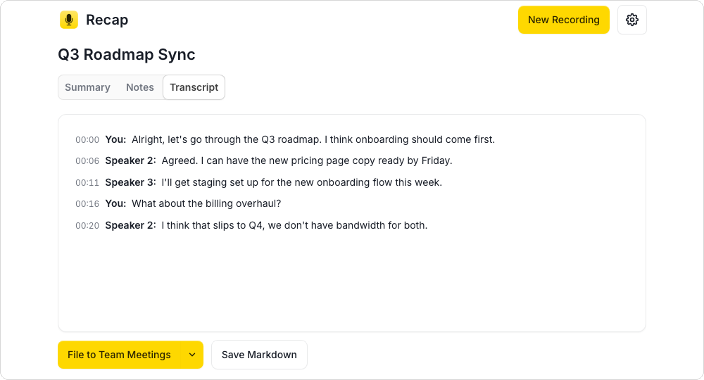

# Recap

I got tired of meeting-notes apps that want a monthly subscription just to
ship my audio off to someone else's server. So this is the one I actually
use: it's a real Mac app that lives in `~/Applications`, records your mic
(and the other side of the call, if you want), transcribes everything
on-device, and only sends the resulting text — never audio — up to Claude
for the summary. Everything else stays on your laptop.

When it's done, it can file the whole thing straight into Notion, formatted
the way a real page should look — action items as checkboxes, real headings,
a collapsible transcript — or just drop a Markdown file on your Desktop if
you'd rather skip Notion entirely.




(Screenshots use placeholder content, not real meeting data — I'm not
putting an actual meeting of mine in a public README.)

## Download

The easiest way to get Recap: no Python, no Homebrew, no terminal.

1. Grab `Recap.app.zip` from the [latest release](https://github.com/markbenivegna/recap/releases/latest), unzip it, and drag `Recap.app` into `~/Applications` (or wherever you keep apps).
2. Right-click (or Control-click) it in Finder and choose **Open** once. Recap isn't notarized — that costs an Apple Developer account, and this is a free tool with no interest in that relationship with Apple — so macOS shows the normal "unidentified developer" warning any downloaded, non-App-Store app gets. That's the standard one-time step every Mac user has always dealt with, not a sign anything's wrong.
3. Open it. See [Configure API keys](#configure-api-keys) below for what happens next.

Prefer to build it yourself, or want to contribute? See [Build from source](#build-from-source).

## Configure API keys

However you got Recap, you'll need two keys:

- **`ANTHROPIC_API_KEY`** — go to [console.anthropic.com](https://console.anthropic.com), sign in (this is a separate pay-as-you-go account from a claude.ai subscription), open **API Keys** in the left sidebar, click **Create Key**, and copy it. A typical meeting (transcription + summarization) costs a few cents.
- **`NOTION_API_KEY`** — go to [notion.so/my-integrations](https://www.notion.so/my-integrations), click **New integration**, give it any name (e.g. "Recap"), and create it. Copy the **Internal Integration Secret** it shows you.
  - **Then, separately**, in Notion itself: open every page or database you want to be able to file meeting notes into, click the **`...`** menu in the top right, go to **Connections**, and connect your new integration. Repeat for each page — pages not explicitly connected this way will never show up in the app's dropdown, even though the API key itself is valid.

The first time Recap opens with no key set, it automatically opens **Settings** (the ⚙ icon) for you to paste both keys in — no text editor, no `.env` required. You can also open Settings any time later to change them, the Whisper model size, vocabulary hints, or the system-audio output device.

Prefer editing a file directly instead? Recap keeps its own data — API keys, the downloaded diarization model, usage tracking — in `~/Library/Application Support/Recap/` (the standard macOS location for this, independent of wherever the app itself lives). Copy `.env.example` from this repo to `~/Library/Application Support/Recap/.env` and fill it in the same way — see the comments in `.env.example` for every available option, including `DIARIZATION_THRESHOLD` (not exposed in the Settings UI since it rarely needs changing).

### First launch

- Clicking **Record** for the first time triggers a normal macOS microphone-permission prompt — click **Allow**.
- The very first recording you transcribe will trigger a one-time download of the `faster-whisper` model (a few hundred MB for the default `small` size) and the speaker-diarization model (`speechbrain/spkrec-ecapa-voxceleb`, downloaded to `~/Library/Application Support/Recap/.cache/`) — expect that first transcription to take noticeably longer than later ones while those download. Everything after that runs fully offline.

## Build from source

For development or contributing — if you just want to use Recap, [Download](#download) above is much less work.

### 0. Prerequisites

- **macOS**, Apple Silicon (arm64) — the build embeds an arm64-only Python runtime inside the app.
- **Python 3.9+** — macOS ships one at `/usr/bin/python3`, or install one via [Homebrew](https://brew.sh) (`brew install python3`).
- **[Homebrew](https://brew.sh)**, for the required system dependencies below.
- **ffmpeg**, used to decode recorded audio before diarization:
  ```bash
  brew install ffmpeg
  ```
  Without this, transcription of anything actually recorded through the app (as opposed to certain uploaded files) will fail silently at the diarization step.

### 1. Clone and install Python dependencies

```bash
git clone https://github.com/markbenivegna/recap.git
cd recap
python3 -m venv venv
source venv/bin/activate
pip install -r requirements.txt
```

(If you're already in the project folder, skip the `git clone`/`cd`.)

### 2. Configure API keys

See [Configure API keys](#configure-api-keys) above — same either way.

### 3. Build the app

```bash
./scripts/build_app.sh
```

This creates **Recap.app** in `~/Applications` with a custom icon — a one-time step that takes a minute or two, and a thin launcher that runs against this checkout's own venv (fast to rebuild, but only works on this machine). Open it from Finder or Launchpad from here on; no terminal needed after this point.

### 4. First launch

Same as [First launch](#first-launch) above, plus the Gatekeeper step from [Download](#download) — `build_app.sh`'s output isn't code-signed either.

### Cutting a real release (maintainers)

`build_app.sh` above is a dev convenience — its output only runs on the machine it was built on (it points at that checkout's own venv, not a bundled copy of everything). A real, standalone, downloadable `Recap.app` — the one [Download](#download) points at — is built differently, via `scripts/recap.spec` (PyInstaller), and published automatically by [`.github/workflows/release.yml`](.github/workflows/release.yml) whenever a version tag is pushed:

```bash
git tag v1.0.0
git push origin v1.0.0
```

That's the whole release process — GitHub Actions builds it on a real macOS runner and publishes the result. To test that build locally instead (needs `pyinstaller` and `dylibbundler`: `pip install -r requirements-build.txt` and `brew install dylibbundler`):

```bash
pyinstaller scripts/recap.spec --noconfirm --distpath dist --workpath build
scripts/bundle_ffmpeg.sh dist/Recap.app
```

## Run

The normal way, day to day: open **Recap** from `~/Applications` (or Launchpad) like any other app.

For debugging, you can also run it directly from a terminal:

```bash
source venv/bin/activate
python3 main.py          # standalone window
python3 -m backend.app   # or: plain web app at http://127.0.0.1:5151
```

If you ever move the project folder, or want to regenerate the icon, re-run `./scripts/build_app.sh` to rebuild the app bundle.

## Flow

Nothing surprising here, which is the point:

1. Click **Record** (grants mic access) or **Upload audio** for an existing file.
2. Stop the recording — it's transcribed locally, then summarized via Claude.
3. Read the result across the **Summary**, **Notes**, and **Transcript** tabs.
4. Either pick a destination from the Notion dropdown (populated live from your workspace) and click **File to Notion** to create a new page there, or click **Save Markdown** to save a `.md` file locally instead — no Notion required.
5. Click **New Recording** to clear the current result and start another one.

## Notes

- Recordings are transcribed then deleted from disk immediately after.
- Only pages/databases explicitly shared with your Notion integration show up in the dropdown.
- `WHISPER_MODEL_SIZE` in `.env` controls the local model (`small` by default; try `medium` for better accuracy or `base` for more speed).

## Why not just use [thing that already exists]

Fair question — there's no shortage of "AI meeting notetaker" products, and
some of them are good. A few reasons I ended up building my own instead:

- I wanted the transcription actually local, not "we don't train on your
  data" local. `faster-whisper` runs on your machine; nothing but the final
  transcript text ever leaves it.
- I wanted it to file into Notion looking like a page I'd actually want to
  read, not a wall of undifferentiated text.
- Mostly, I just wanted to know exactly what it does, because I wrote it.

If you just want something that works today without touching a terminal,
a paid app is probably the better trade. This one's for people who'd rather
own the thing.

## System audio (hearing both sides of a call)

By default, Record only captures your microphone. To also capture whatever's
playing out of your speakers (e.g. the other person on a Zoom/Meet call):

1. Install [BlackHole](https://github.com/ExistentialAudio/BlackHole), a free virtual audio driver:
   ```bash
   brew install blackhole-2ch
   ```
2. Open **Audio MIDI Setup** (Applications → Utilities), click `+` → **Create Multi-Output Device**, and check both your normal speakers and "BlackHole 2ch".
3. Set that Multi-Output Device as your system sound output (System Settings → Sound, or the menu bar volume icon).

Once that's set up, the app automatically detects BlackHole and mixes it with
your mic when you hit Record — no extra steps in the app itself. If BlackHole
isn't installed or isn't wired up yet, it just falls back to mic-only, same
as before.

### Auto-switching to the recording device

If you don't want your Multi-Output Device as your everyday sound output
(most people don't — it complicates normal volume control), the app can
switch your system output to it automatically only while recording, and
switch back to whatever you were using right after you hit Stop:

1. Install the audio-switching CLI tool:
   ```bash
   brew install switchaudio-osx
   ```
2. Set `RECORDING_OUTPUT_DEVICE` in `.env` to the exact name of your
   Multi-Output Device (as it appears in Audio MIDI Setup / System Settings
   → Sound) — rename it there to something memorable if you want.

With that set, hitting Record switches your output to that device, and
Stop switches back to whatever was active before. If the tool isn't
installed or the device name doesn't match anything currently available,
this step is silently skipped and nothing about recording itself changes.

If your speakers are connected over Bluetooth, macOS's Multi-Output Device
handling of Bluetooth output is unreliable (a known OS-level limitation, not
something this app or BlackHole can work around) — if you get silence after
setting this up, double check System Settings → Sound (or the menu bar) has
the **Multi-Output Device** selected, not BlackHole directly (selecting
BlackHole alone sends everything to a silent virtual sink). Also note that
while a Multi-Output Device is your output, the normal volume keys/menu bar
slider often stop reliably controlling your actual speakers — use the volume
slider next to your speakers inside the Multi-Output Device panel in Audio
MIDI Setup instead.

## Speaker labels

This was the hardest part to get right, honestly. Recordings are
automatically split by speaker using a speaker-embedding
model (`speechbrain/spkrec-ecapa-voxceleb` — an openly downloadable model, no
account or sign-up needed, unlike some diarization tools). This runs locally
alongside Whisper. When summarizing, Claude will use a speaker's real name in
the summary/notes if it's clear from what's actually said in the
conversation (e.g. someone being greeted or introduced by name); otherwise it
keeps the generic label rather than guessing.

When [system audio capture](#system-audio-hearing-both-sides-of-a-call) is
active, the app records the mic and system audio as two extra, separate
reference tracks (in addition to the main mixed recording used for
transcription) so it can tell which source each moment of the transcript
came from directly, by comparing loudness, rather than relying purely on
voice similarity — which struggles when two voices happen to sound alike.
The dominant voice on the mic is labeled **"You"**; every other distinct
voice — whether an extra voice sharing the mic (e.g. an in-person guest) or
any number of voices coming through system audio — gets a normal "Speaker N"
label. Without system audio capture active, it falls back to
voice-embedding clustering alone across the whole recording, same as before.

`DIARIZATION_THRESHOLD` in `.env` controls how aggressively segments are
split into different speakers vs. merged together — see `.env.example` for
details. The embedding model downloads once (to
`~/Library/Application Support/Recap/.cache/`) on first use.
